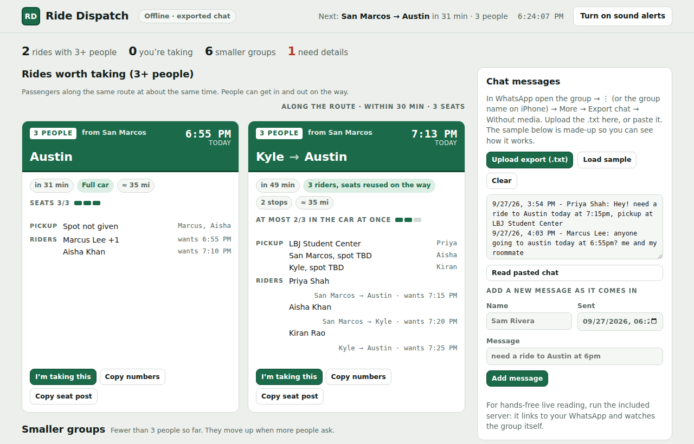

# Ride Dispatch

For a driver with one car and a WhatsApp ride group. Ride Dispatch reads the group's messages ("need a ride to Austin at 5pm", "me and my roommate", "nvm found a ride"), finds passengers going to the same place at about the same time, and alerts you when a group is big enough to be worth the trip. You decide whether to go.



## Two ways to use it

| | Live (this server) | Offline (single HTML page) |
|---|---|---|
| Where messages come from | Read automatically from your WhatsApp groups as they're posted | You upload or paste WhatsApp's **Export chat** .txt |
| Alerts | Your own WhatsApp chat, phone push (free **ntfy** app), and the dashboard | The open browser tab (toast + sound) |
| Setup | Node 20+, scan one QR code | None: open `dist/ride-dispatch.html` after `npm run build` |

## Live setup

```bash
npm install
npm start
```

1. Open http://localhost:3000.
2. On your phone: WhatsApp → Settings → Linked devices → Link a device, and scan the QR code.
3. Tick your ride group under **Groups to watch**, or paste its invite link and click **Join & watch**.
4. Under **Your settings**, set your seats and the minimum number of people that makes a ride worth it.
5. Optional: to include requests posted before the app was linked, export the group (WhatsApp → the group → ⋮ → More → **Export chat** → Without media) and choose the file under **Import earlier messages**. The last 30 days are added; duplicates are skipped and no alerts are sent for them.

Mac users can double-click `Start Ride Dispatch (Mac).command`; Windows users `Start Ride Dispatch (Windows).bat`. To keep it running with the terminal closed: `npx pm2 start "caffeinate -i node server.js" --name rides` (Mac).

**On your phone:** on the Mac dashboard, open **Phone access** and set a password. Install the free **Tailscale** app on the Mac and the phone (same account), then open the `http://100.x.x.x:3000` address shown in Phone access on your phone and log in. On the same Wi-Fi, the Wi-Fi address works too. The Mac itself never asks for the password.

**Alerts go to** your own WhatsApp "Message yourself" chat (on by default), optional phone push through the free **ntfy** app (enter a topic name in settings), and the dashboard (click **Turn on sound alerts**). The app never posts in the group unless you click **Post seats to group**.

## How it finds rides for you

You drive one car and decide yourself whether a trip is worth it. The app finds passengers for you.

- **Rides worth taking:** passengers going to the **same place** at about the **same time** (within 30 min by default), up to your seats. A group is "worth it" once it has your minimum number of people (default 3, set in **Your settings**). "Me and my roommate" counts as 2.
- **Alerts:** you get one alert when a group reaches your minimum, with names, numbers and times, and another when someone new joins it.
- **I'm taking this:** marks the ride as yours. New matching passengers are added to it, and you get a reminder before you leave with who to pick up.
- **Smaller groups** (below your minimum) are listed with **Take anyway**. No alerts for them.
- **Route and time filter** at the very top: pick From and To cities and a time window (e.g. San Marcos → Austin, 5–8 PM). Every section shows only matching rides; riders getting in or out on the way count, and a window like 10 PM–2 AM crosses midnight. **Clear** shows everything again.
- **Tabs** below it: All, Worth taking, Smaller groups, Needs details, Coming days and Find passengers, with counts. Each ride appears once. "rn", "right now" and "asap" requests stay listed for 90 minutes; a request with no time is treated as needed now and marked "time not given"; today's requests whose time passed are under **Earlier today**.
- **Today only:** Today, Rides worth taking, Smaller groups and Needs details show only rides happening today. A request made on an earlier day for today ("Tuesday 5pm" posted on Sunday) is remembered and shows on the day; messages are kept 30 days. Requests for later dates are under **Coming days**, grouped on their day. The dashboard shows ride data only, not the chat messages.
- **Along the route, both directions** (on by default): riders whose start and destination are both on your route are grouped, in the right order. For example, San Marcos → Kyle → Buda → Austin can pick someone up in Kyle, drop someone in Kyle, and reuse that seat. Each rider is matched to when the car passes their city. Untick it in settings to group only riders going between the same two cities.
- **Round trips:** "to Austin at 3pm and back at 7pm" or "return at noon to sm" becomes two requests, the way there and the way back, each grouped with others on its own time; "back and forth" with no return time is marked "round trip, return time not given". An hour without am/pm ("at 9:30" sent at 9 PM) means the next time that hour comes round.
- **One person, one request:** people are recognized by phone number (then WhatsApp ID, then name), so reposts, corrections and name changes don't create duplicates. A newer message replaces the older one when it's the same trip (same destination, or a time within 2 hours); a separate trip like the way back is kept. Nobody appears twice in one car.
- Drivers offering rides in the group are listed but never used.
- **Find passengers for your trip:** at the top of the dashboard, pick From, To, the date and the window you're free (e.g. 5–8 PM). It shows the best times to leave, most passengers first, plus everyone asking for that route in your window. **Save & alert me** keeps the search and alerts you when your minimum number of people fit. The search always looks along your whole route: each passenger is labelled (same trip, gets in at Kyle, gets out at Kyle), and **Partly on your way** lists riders whose trip overlaps yours but starts or ends beyond it (e.g. Kyle → Round Rock when you drive to Austin), so you can ask them. Choose the same city for From and To (e.g. San Marcos → San Marcos) to find rides **within** that city, including trips between areas of it (North Austin → South Austin when searching Austin). Pickups and drop-offs within 12 miles of your start and end are included (change it in settings); cards show each leg in miles, and the results show each rider's trip length and how far their pickup is from you.

## Cities

Texas cities around San Marcos, areas of Austin (North/South/East/West Austin, Downtown, UT campus, the Domain, Mueller, Riverside, Oak Hill, Circle C, Tech Ridge, Leander, Manor and more), plus the AUS, SAT, IAH and DFW airports, are built in with nicknames (atx, satx, nb, "the airport", and so on). Places inside San Marcos (campus, "university", Country Oaks, the outlets, the Square, apartment complexes) count as San Marcos, so a ride between two of them is a ride within town. Edit `DEFAULT_CITIES` and `COORDS` in `lib/rides.js` to add more. A city without coordinates still pools, but only with riders going to exactly that city.

## Files

- `server.js`: WhatsApp connection (Baileys), alerts, dashboard API
- `lib/rides.js`: message understanding and grouping. Shared by the server and the offline page.
- `public/index.html`: the dashboard
- `build-offline.js`: `npm run build` writes `dist/ride-dispatch.html`, a single offline file
- `test/rides.test.js`: `npm test`
- `data/`: your saved login session, messages and settings. Delete `data/auth` to unlink.

## Good to know

- This uses WhatsApp Web's linked-device protocol through the unofficial Baileys library. WhatsApp does not officially support it, and heavy automated posting can get a number restricted. The app only reads, and posts only when you click. Using a spare number is safest.
- Group members' messages and phone numbers are stored in `data/` on your computer. `data/` is in `.gitignore`; never commit it (it also holds your WhatsApp login).

## Run it on an Android phone (Termux)

1. Install **Termux** from F-Droid (f-droid.org). The Play Store version is outdated.
2. In Termux: `pkg update && pkg install nodejs-lts git`, then `git clone https://github.com/sandeepsudula/ride-dispatch && cd ride-dispatch && npm install`.
3. Keep it running: `termux-wake-lock`, then `node server.js`. In Android settings, set Termux's battery use to **Unrestricted**.
4. Open http://localhost:3000 in Chrome on the phone. Instead of scanning the QR code, enter your number under **Link with a code instead**, then in WhatsApp: Linked devices → Link a device → **Link with phone number instead** and type the code.
5. Stop the copy on your Mac first, so two copies don't share one WhatsApp login.

## Run it in the cloud (alerts while your Mac sleeps)

Uses Railway (railway.com, about $5/month). Run these from this folder in a terminal:

1. `npx @railway/cli login`, then `npx @railway/cli init` (name the project, e.g. ride-dispatch), then `npx @railway/cli up`.
2. In the Railway website, open the service:
   - **Variables:** add `DASHBOARD_PASSWORD` (your choice), `DATA_DIR` = `/data`, `TZ` = `America/Chicago`.
   - **Volume:** attach a volume mounted at `/data`. This keeps your WhatsApp login across restarts.
   - **Settings → Networking → Generate Domain** to get a web address.
3. Open that address on your phone or computer, enter any username plus your password, scan the QR code and tick the ride group.
4. Stop the copy on your Mac (`npx pm2 stop rides` or Control + C) so two copies don't share one WhatsApp login.

Other devices can only open the dashboard after logging in with the phone password (set in **Phone access**, or with `DASHBOARD_PASSWORD`). Without one, only the computer running the app can open it.
